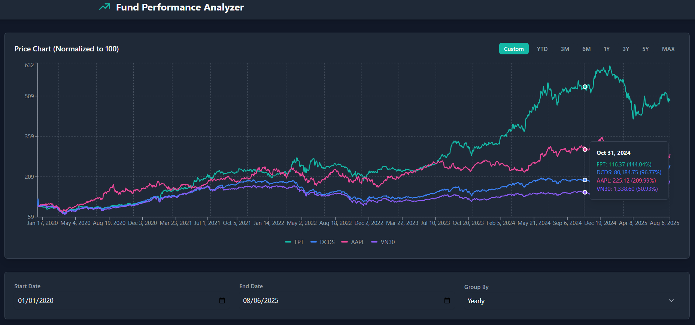
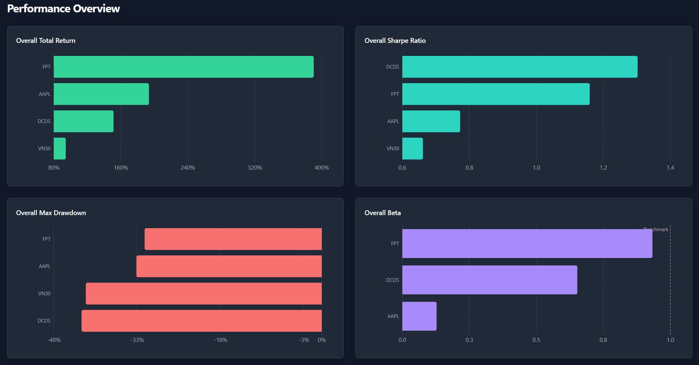

# 📈 Investment Performance Analyzer (v2.5)

---

> A dynamic web application designed to provide comprehensive analysis of performance metrics of funds and stocks through interactive charts and detailed analytics. This project leverages modern web technologies including React, Vite, and TypeScript to deliver a responsive and intuitive user experience.

## 🔍 Overview

The application allows users to:

* **Visualize Performance:** Access interactive charts displaying performance trends, beta analysis, drawdowns, and more.
* **Analyze Metrics:** Dive into various fund/stock metrics and analytics to inform investment decisions.
* **Real-time Data Integration:** Connect seamlessly with financial data services to pull in the latest fund/stock information.

---

## 🖼 Screenshots & Usage Guide

### 1. Load Performance Data


*Select the time range, choose your benchmark, and add the assets (stocks/funds) you want to compare.*

### 2. Price Chart (Normalized to 100)


*View normalized price movements over time for all selected assets and the benchmark.*

### 3. Performance Overview


*Get a quick view of key performance metrics like Total Return, Sharpe Ratio, Max Drawdown, and Beta.*

### 4. Yearly Performance Metrics


*Analyze performance changes year-by-year across different metrics.*

### 5. Detailed Metrics Table


*Explore a comprehensive table of returns, Sharpe ratios, drawdowns, and beta values for each year.*

---

## ✨ Features

* **Performance Charts:** Detailed visualizations of fund/stock performance over time.
* **Risk Analysis:** Insights into volatility, drawdowns, and other risk measures.
* **Interactive UI:** User-friendly components for an enhanced data exploration experience.
* **Modular Architecture:** Easily extensible components and services for future features.

---

## ⚙️ Installation

1. **Clone the repository:**

   ```bash
   git clone https://github.com/lengoctuong/Investment-Analyzing-App.git
   cd Investment-Analyzing-App
   ```

2. **Set up the Python Data Server:**

   * Install the required Python libraries:

     ```bash
     pip install pandas vnstock yfinance fastapi uvicorn
     ```
   * Run the server to serve financial data:

     ```bash
     uvicorn services.finance-server:app --reload
     ```

3. **Install frontend dependencies:**
   *(In a new terminal window)*

   ```bash
   npm install
   ```

4. **Run the development server:**

   ```bash
   npm run dev
   ```

5. **Open the app:** Visit `http://localhost:3000` in your browser.

---

## 📂 Project Structure

* `App.tsx`: The main entry point of the application.
* `components/`: Contains UI components such as charts, tables, and controls.
* `services/`: Houses API services and performance calculation logic.
* `index.html` & `index.tsx`: Serve as the foundation for rendering the app.

---

## 🤝 Contributing

Contributions are welcome! Please fork the repository and submit pull requests for any improvements or bug fixes.

---

## 📜 License

This project is licensed under the MIT License.

---

📌 *Note: This documentation and screenshots reflect version **2.5** of the application.*
